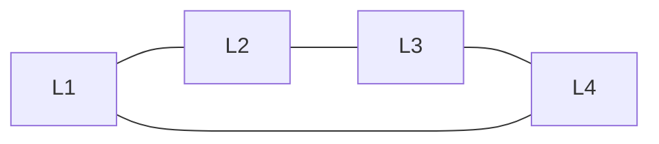

Free Energy Perturbation (FEP) has evolved dramatically in the last decade. Where early alchemical calculations focused on **single A→B transformations**, modern drug discovery now relies on **multi-edge ligand networks** that scale to entire ligand series.

This article summarizes my understanding of:

- What single-edge FEP really is  
- Why single-edge approaches cannot scale  
- What a ligand network is (conceptually and mathematically)  
- Why Relative Binding Free Energy (RBFE) frameworks rely on networks  
- Which tools implement ligand networks today  
- How to practically run network-based FEP in real drug discovery projects

---

# 1. Single-Edge FEP: The Classical Perspective
A traditional alchemical calculation transforms:
          **Ligand A → Ligand B**

using two thermodynamic legs:
1. **Complex leg:** A→B inside the protein binding site  
2. **Solvent leg:** A→B in water  

The relative binding free energy is:

$$
\Delta\Delta G_{\text{binding}}
=
\Delta G_{\text{complex}}
-
\Delta G_{\text{solvent}}
$$

---
Single-edge FEP is extremely useful for:

- Hydration free energies  
- Host–guest systems  
- Small methodological benchmarks  
- Pairwise ligand comparisons  
---

# 2. Single-edge calculations do **not** scale to medicinal chemistry campaigns

Real-world ligand series contain:

- 10, 20, sometimes 100+ analogs  
- Diverse scaffolds and R-group patterns  
- Non-trivial mapping relationships  
- Large chemistry jumps that do not mutate smoothly

If we attempted single-edge FEP naively:

- Pairwise combinations grow as $O(N^2)$ 
- Many ligand pairs are **too dissimilar** to mutate directly  
- Transformations become unstable  
- Sampling cost becomes prohibitive  
- No cycle-closure diagnostics are possible  
- No systematic way to evaluate the entire ligand series

In practice:

> Drug discovery requires a *system-level* approach — not isolated A→B comparisons.

This leads naturally to **ligand networks**.

---

# 3. Ligand Networks: The Modern RBFE Paradigm

A ligand network is a **graph** where:

- **Nodes = ligands**  
- **Edges = alchemical transformations**

Example of a simple network:

