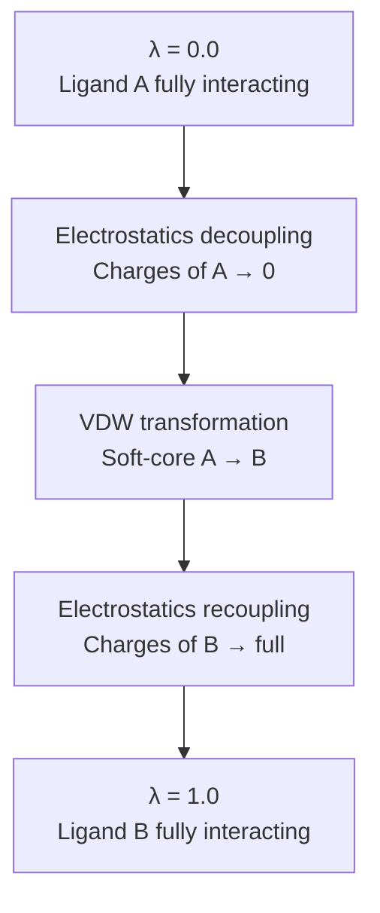

## RBFE

Relative Binding Free Energy (RBFE) calculations are a cornerstone of modern computational drug discovery. They aim to predict how a small chemical modification—for example, changing one substituent on a ligand—affects binding affinity to a protein target.
Rather than computing absolute binding free energies independently for two ligands, RBFE focuses on the **difference**:

$$
\Delta\Delta G_{\text{binding}}
=
\Delta G_{\text{bind}}^B
-
\Delta G_{\text{bind}}^A
$$

This relative quantity is typically much more accurate and computationally efficient, because the two ligands are chemically similar and share much of their phase space.

To compute this quantity rigorously, RBFE relies on **alchemical transformations** that close a thermodynamic cycle.


### Why Alchemical Free Energy Methods Work

Alchemical free energy methods connect two physical states—such as Ligand A and Ligand B—through a sequence of **non-physical intermediate states**. These intermediate states do not correspond to realizable chemical systems; instead, they are constructed by smoothly modifying the Hamiltonian.

From a statistical mechanics perspective, the key idea is **phase-space overlap**. By introducing intermediate alchemical states, we ensure that neighboring ensembles share sufficient overlap, allowing free energy estimators (e.g., BAR and MBAR) to operate efficiently and with low bias.

In short:

> Alchemy works because it replaces a difficult, discontinuous transformation with a smooth, overlap-preserving path.


## Thermodynamic Cycle

RBFE calculations rely on a thermodynamic cycle that decomposes binding into two alchemical transformations performed in different environments.

### Two legs

The cycle consists of two alchemical legs, both transforming Ligand A into Ligand B:

> 1. Complex Leg $\Delta G_{\text{complex}}$

* **Goal:** Calculate the free energy change &Delta;G for the alchemical transformation of Ligand A into Ligand B while the **ligands are bound to the protein target**.
* **Environment:** Ligand + Target (Protein) + Solvent (Water)

> 2. Solvation Leg $\Delta G_{\text{solvent}}$

* **Goal:** Calculate the free energy change &Delta;G for the alchemical transformation of Ligand A into Ligand B while the **ligands are free in the solvent**.
* **Environment:** Ligand + Solvent (Water)

The final Relative Binding Free Energy is the difference between these two alchemical transformations: 

$$
\Delta\Delta G_{\text{binding}}
=
\Delta G_{\text{complex}}
-
\Delta G_{\text{solvation}}
$$

Because free energy is a state function, the result is independent of the non-physical alchemical path used.


### Forward vs Reverse Transformation (A→B and B→A)

In practice, we often compute the alchemical change in *both* directions:

- **Forward:** Ligand A → Ligand B
- **Reverse:** Ligand B → Ligand A

If the simulations are well-converged and there is sufficient phase-space overlap between neighboring $\lambda$ windows, the two estimates should agree:

$$
\Delta G_{A\to B} \approx -\Delta G_{B\to A}
$$

The difference between them is a useful **diagnostic**:

- **Hysteresis (forward–reverse mismatch):**

$$
\Delta G_{\text{hyst}} = \Delta G_{A\to B} + \Delta G_{B\to A}
$$

A large $\Delta G_{\text{hyst}}$ typically indicates **insufficient sampling** or **poor overlap** (often near endpoints, especially for VDW decoupling without enough soft-core / $\lambda$ windows).

### Why do we care?

- **Overlap:** Forward-only estimators (e.g., the Zwanzig FEP formula) can be biased when overlap is poor.
- **Robustness:** Bidirectional estimators like **BAR** and **MBAR** use information from both directions to reduce variance and bias.

### Connection to BAR / MBAR (why “both directions” is modern best practice)

For two adjacent $\lambda$ states $i$ and $j$, BAR combines samples from both ensembles:

$$
\Delta G_{i\to j} = \text{BAR}(U_i, U_j)
$$

Intuitively:
- Forward samples tell you how likely state $j$ configurations are under state $i$
- Reverse samples tell you how likely state $i$ configurations are under state $j$

When overlap is good, BAR/MBAR are very stable; when overlap is poor, they will show **large uncertainty** or inconsistent forward/reverse behavior—telling you exactly where to add more sampling or more $\lambda$ windows.

### Practical checklist (what to do if forward/reverse disagree)

1. **Add sampling** at the problematic $\lambda$ windows (often near endpoints).
2. **Increase window density** where $\langle \partial U/\partial \lambda\rangle$ or energy differences spike.
3. **Use/verify soft-core** for VDW scaling to prevent endpoint instabilities.
4. **Check ligand mapping / restraints** (especially if the ligand can drift or reorient).


## The Alchemical Methods

Each leg of the thermodynamic cycle requires a statistically rigorous method to compute the free energy change along the alchemical path.

### Free Energy Perturbation (FEP)

FEP is based on the Zwanzig relation, which estimates the free energy difference between two states from an exponential average of energy differences:

$$
\Delta G = -kTln(e^{-\beta\Delta U})
$$

In modern workflows, FEP is rarely applied as a single step. Instead, the transformation is broken into discrete **λ windows**, and the resulting data are analyzed using **BAR or MBAR**. This approach is the default in contemporary packages such as OpenFE, Perses, and Schrödinger FEP+.

### Thermodynamic Integration (TI)

TI computes free energy differences by integrating the ensemble-averaged derivative of the Hamiltonian:

$$
\Delta G
=
\int_{0}^{1}
\left\langle
\frac{\partial H}{\partial \lambda}
\right\rangle_{\lambda}
\, d\lambda
$$

TI requires smooth behavior of ⟨∂H/∂λ⟩ and sufficiently dense λ sampling. While statistically rigorous, it is often less efficient than BAR/MBAR-based FEP for high-throughput RBFE studies.


## Decoupling and &lambda; schedule

Alchemical transformations are implemented by **scaling interaction terms** in the Hamiltonian using a coupling parameter λ. Importantly, λ is not a physical reaction coordinate, but a bookkeeping device that defines a family of Hamiltonians.

### The Decoupling Process

Although RBFE uses relative transformations, it is helpful to understand decoupling via the absolute binding free energy (ABFE) framework.

The double-decoupling method expresses binding as:

$$\Delta G_{\text{bind}} =
\Delta G_{\text{decouple}}^{\text{protein}} -
\Delta G_{\text{decouple}}^{\text{solvent}}$$

Decoupling proceeds by gradually eliminating ligand–environment interactions until the ligand becomes a non-interacting “ghost” particle.

To avoid numerical instabilities, interactions are typically removed in stages:

* **Electrostatics**: Charges are scaled smoothly to zero
* **Van der Waals**: Lennard-Jones interactions are removed using soft-core potentials

|    State  |            Physical Process                 | Alchemical Process (Decoupling) |
| ----------| ------------------------------------------- | ------------------------------- |
| **Bound** |       Ligand + Protein &harr; Complex       | $\Delta G_{\text{decouple}}^{\text{protein}}$:Turn off the ligand's interactions with its environment (protein and solvent) in the binding pocket. |
| **Unbound (Solvent)** | Ligand (gas) &harr; Ligand (solvent) | $\Delta G_{\text{decouple}}^{\text{solvent}}$: Turn off the ligand's interactions with the bulk solvent. |


### The Lambda lambda Schedule

In alchemical simulations, the coupling parameter λ defines a continuum of Hamiltonians between two endstates. Rather than being a physical reaction coordinate, λ *scales interaction terms* in the potential energy function so that ligand A interactions are gradually reduced while ligand B interactions are gradually increased. Because it alters how strongly atoms interact with their environment (e.g., electrostatics and van der Waals), λ creates a smooth path through a series of overlapping ensembles. This is why MBAR and BAR can reliably estimate free energy differences — they exploit the overlap across these discretized λ windows.


$$\lambda = 
\{ \lambda_0, \lambda_1, \lambda_2, \ldots, \lambda_N \}
$$

The total free energy change $\Delta G$ is the sum of the changes between adjacent windows:

$$\Delta G = 
\sum_{i=0}^{N-1} \Delta G(\lambda_i \to \lambda_{i+1})$$

Accurate calculation requires that the **phase-space overlap** between consecutive windows is sufficient. If the $\lambda$ values are too far apart, the overlap is poor, leading to large statistical errors and unconverged results.

**Choosing an effective λ schedule**

|Area of Transformation| Optimal Schedule | Rationale |
|----------------------|------------------|-----------|
|  **Electrostatics**  |Generally linear or evenly spaced $\lambda$ values.|The free energy profile with respect to $\lambda$ is relatively smooth.|
|**Van der Waals (VDW)**|Non-linear or unevenly spaced $\lambda$ values.|The VDW coupling term $\langle \partial U / \partial \lambda \rangle$ peaks sharply near the endpoints ($\lambda \approx 0$ and $\lambda \approx 1$). More $\lambda$ points are needed near the ends to capture these non-linear changes.|
|**Binding Pocket**|More $\lambda$ points are needed for the $\Delta G_{\text{decouple}}^{\text{protein}}$ arm.|The ligand's movement in the restrictive, heterogeneous environment of the protein pocket requires more sampling to converge compared to the bulk solvent.|


## Alchemical Simulation Workflow

1. **Define λ windows:** A set of values $\lambda_0, \lambda_1, ..., \lambda_N$ is chosen between 0 and 1, often with more windows near endpoints where interactions change quickly (e.g., VDW/soft-core regions).  
2. **Run MD at each λ:** Molecular dynamics samples configurations $x$ at each window.  
3. **Evaluate energies across windows:** For each sampled configuration, energies under all nearby λ values are evaluated to quantify overlap.  
4. **Estimate $\Delta G$:** Estimators like BAR or MBAR combine all sampled and cross-evaluated energies across windows to compute free energy changes between adjacent windows and sum them for the total $\Delta G$.  
5. **Compute RBFE:** The difference between complex and solvent free energies yields the relative binding free energy:

   $$
   \Delta\Delta G_{\text{binding}} = \Delta G_{\text{complex}} - \Delta G_{\text{solvent}}
  $$

**Example**

```bash 
λ:   0.0        0.3        0.7        1.0
     |----------|----------|----------|
     Phase I    Phase II   Phase III

Phase I   : Turn OFF electrostatics of A
Phase II  : Swap VDW of A ↔ B (soft-core)
Phase III : Turn ON electrostatics of B
```



```bash
λ = 0                                                λ = 1
|-- elec off --|====== VDW soft-core ======|-- elec on --|
      sparse          DENSE DENSE DENSE         sparse
```

<script>
document.addEventListener("DOMContentLoaded", function () {
  const sections = document.querySelectorAll("h2, h3");
  const tocLinks = document.querySelectorAll("d-contents a");

  function onScroll() {
    let current = null;
    sections.forEach(section => {
      const rect = section.getBoundingClientRect();
      if (rect.top <= 120) current = section.id;
    });

    tocLinks.forEach(link => {
      link.classList.remove("active");
      if (current && link.getAttribute("href") === "#" + current) {
        link.classList.add("active");
      }
    });
  }

  window.addEventListener("scroll", onScroll);
  onScroll();
});
</script>


